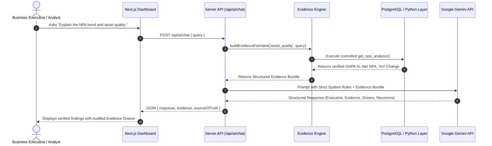

# AI Architecture & Decision Intelligence Engine

## 1. Core AI Philosophy: Evidence-Driven Interpretation
In modern banking, autonomous LLMs must never be permitted direct, unrestricted query access to transactional or analytical databases. A model generating hallucinated SQL queries or mathematical aggregates introduces systemic regulatory and operational risk.

Our architecture enforces a strict **Evidence Contract**:
```
User Question 
      ↓
Intent & Entity Extraction 
      ↓
Predefined Controlled SQL / Python Function
      ↓
Validated Evidence Bundle (Source of Truth)
      ↓
Google Gemini API (Server-Side)
      ↓
Structured Business Explanation & Recommendation
```



---

## 2. The AI Evidence Contract Schema
Before any prompt is dispatched to Gemini, verified data is packaged into an explicit JSON contract:

```typescript
interface AnalyticalEvidenceItem {
  metric: string;               // e.g., "Gross NPA Ratio"
  current_value: number;        // e.g., 2.80
  previous_value?: number;      // e.g., 4.20
  change_percentage?: number;   // e.g., -1.40
  period: string;               // e.g., "FY2024"
  entity: string;               // e.g., "Scheduled Commercial Banks"
  source: string;               // e.g., "Reserve Bank of India (SCB Tables)"
  calculation_source: string;   // e.g., "PostgreSQL View / Python ETL"
  validation_status: string;    // "validated"
  benchmark?: string;           // e.g., "Prudential Threshold < 4.0%"
}
```

---

## 3. Hallucination Control Protocols
1. **Zero Mathematical Extrapolation**: The LLM is instructed not to perform multi-step statistical or arithmetic calculations. All sums, averages, and deltas are pre-computed in SQL/Python.
2. **Explicit Fact vs. Hypothesis Labeling**: The prompt mandates separating verified evidence from operational hypotheses.
3. **Acknowledgment of Insufficient Evidence**: If a user asks for data outside the RBI BSR/SCB parameters (e.g., individual customer accounts), the model explicitly states that data is unavailable.
4. **Isolated Credentials**: The `GEMINI_API_KEY` is strictly confined to server-side Node.js execution and never exposed client-side.
