# End-to-End Data Flow Architecture

This document tracks the complete data lifecycle from raw public releases to boardroom decision briefs.

```mermaid
flowchart LR
    A[Official RBI Releases] --> B[Raw Ingestion CSVs]
    B --> C[Python Data Cleaning]
    C --> D[Domain Validation Engine]
    D --> E[Feature Engineering & Anomaly Detection]
    E --> F[(PostgreSQL Database)]
    F --> G[Controlled SQL Analytics]
    G --> H[Audited Evidence Bundle]
    H --> I[Google Gemini API Layer]
    I --> J[Next.js Interactive Dashboard]
    J --> K[ReportLab PDF Executive Brief]
```

### Stage-by-Stage Breakdown

| Stage | Input | Primary Tool / Tech | Processing | Output |
| :--- | :--- | :--- | :--- | :--- |
| **1. Source Ingestion** | RBI DBIE & BSR Archives | Python / Requests | Multi-dimensional compilation across banks, states, districts, and sectors. | `data/raw/*.csv` (137,984+ rows) |
| **2. Data Cleaning** | Raw CSVs | Pandas / NumPy | Strips whitespace, standardizes casing, converts formatted numbers with commas, median-imputes nulls. | Cleaned DataFrames |
| **3. Validation** | Clean DataFrames | Python Banking Validator | Verifies domain accounting axioms ($NNPA \le GNPA$, non-negative constraints). | Completeness & Consistency Scores |
| **4. Feature Engineering** | Validated Data | Pandas / NumPy | Computes YoY growth rates, CD ratio buckets, Risk classifications. | `data/processed/*.parquet` |
| **5. Anomaly Detection** | Clean Data | Statistical Engine | Computes Z-scores ($|Z| > 2.5$), IQR fences, and delta growth surges. | Anomaly Audit Records |
| **6. Relational Persistence** | Processed Datasets | PostgreSQL / SQLAlchemy | Loads star-schema relational tables, applies B-Tree indexes and views. | Relational Tables & Views |
| **7. SQL Analytics** | PostgreSQL Tables | Controlled SQL Queries | Aggregations, window functions, and rankings without arbitrary queries. | Verified Analytical Metrics |
| **8. Evidence Bundling** | SQL Outputs | TypeScript Service | Packages metrics into the strict Evidence Contract JSON. | Evidence Bundle |
| **9. AI Interpretation** | Evidence Bundle | Google Gemini API (Server-Side)| Translates verified evidence into boardroom explanations and next steps. | Structured AI Response |
| **10. Delivery** | AI Response + Metrics | Next.js 15 & ReportLab | Responsive fintech dashboard, grounded document chat, and executive PDF. | Production UI / PDF Brief |
