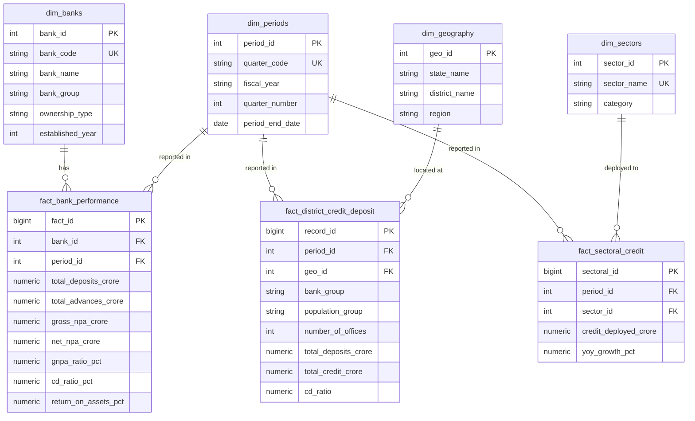

# Database Architecture & PostgreSQL Analytical Design

## 1. Relational Star/Snowflake Schema
The analytical database uses a dimensional model optimized for multi-year aggregation, slicing across geographic entities, and tracking banking balance sheet metrics.

---

## 2. Indexing and Query Performance Strategy
- **Composite State & Period Indexes**: `CREATE INDEX idx_fact_dist_geo_period ON fact_district_credit_deposit(geo_id, period_id);` ensures that geographic filtering across 137,984 rows executes in sub-millisecond time.
- **Analytical Views with Window Functions**:
  - `v_bank_performance_summary` utilizes `LAG()` over partitioned bank series for instant YoY growth computation.
  - `v_state_credit_deposit_rankings` pre-computes national credit share and state ranks using `DENSE_RANK() OVER (PARTITION BY quarter_code ORDER BY state_credit_crore DESC)`.

---

## 3. Hosted PostgreSQL Support
The application connects via standard connection strings:
`DATABASE_URL=postgresql://[user]:[password]@[host]:[port]/[database]?sslmode=require`
Supports providers including Neon, Supabase, Railway, Render, and AWS RDS. If `DATABASE_URL` is absent during local development or offline interview presentations, the service automatically falls back to pre-compiled relational analytical parquet/JSON data without interruption.
