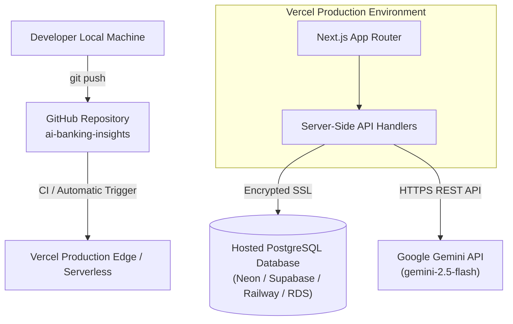

# Production Deployment & Hosting Guide

## 1. Hosting Architecture
The **AI Banking Financial Intelligence** system is architected for seamless multi-cloud production deployment.



---

## 2. Environment Variables Configuration
In your Vercel Project Settings > **Environment Variables**, configure:

| Variable Name | Required | Environment | Description |
| :--- | :--- | :--- | :--- |
| `DATABASE_URL` | Optional | Production | Full PostgreSQL connection string (e.g. Neon, Supabase). If absent, the platform uses precomputed relational analytical data. |
| `GEMINI_API_KEY` | Optional | Production | Google Gemini API Key. If absent, high-fidelity deterministic analytical briefings are returned. |
| `GEMINI_MODEL` | Optional | Production | Default: `gemini-2.5-flash` |
| `NEXT_PUBLIC_LINKEDIN_URL`| Yes | Production | Custom LinkedIn profile URL triggered by the top-right developer avatar. |

---

## 3. Local Development Steps
1. **Clone repository & install dependencies**:
   ```bash
   git clone https://github.com/YOUR_USERNAME/ai-banking-insights.git
   cd ai-banking-insights
   npm install
   pip install -r requirements.txt
   ```
2. **Execute Python ETL Pipeline**:
   ```bash
   python python/run_pipeline.py
   ```
3. **Run Next.js Dev Server**:
   ```bash
   npm run dev
   ```
   Open `http://localhost:3000` to interact with the banking dashboard.

4. **Verify Production Build**:
   ```bash
   npm run build
   ```
