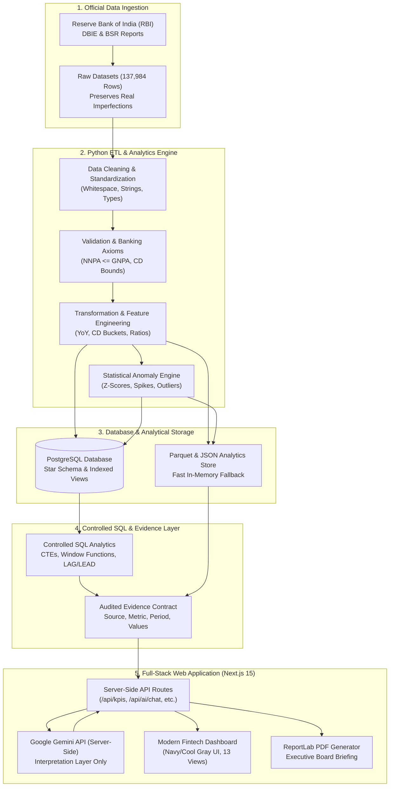

# High-Level System Architecture

## 1. End-to-End System Overview
The **AI Banking Financial Intelligence** platform (*AI Banking Insights*) is an enterprise banking analytics and AI decision-support platform. It bridges data engineering, relational database modeling, advanced SQL window functions, statistical anomaly surveillance, business intelligence, and server-side LLM interpretation.

---

## 2. Core Architectural Tenets
1. **Separation of Computation and Interpretation**:
   - Python + SQL + PostgreSQL are the **sole Source of Truth**.
   - Google Gemini acts exclusively as an **Interpretation Layer**.
   - The LLM is never granted arbitrary SQL execution, database write privileges, or unsupervised mathematical extrapolation.

2. **Audited Evidence Contract**:
   - Every AI insight is backed by an unambiguous evidence bundle: metric name, current value, previous period value, percentage change, reporting entity, fiscal period, source dataset, and calculation methodology.

3. **Production Cloud Resilience**:
   - Ready for hosted PostgreSQL (`DATABASE_URL`) on platforms such as Neon, Supabase, Railway, AWS RDS, and Render.
   - Deploys on Vercel with zero runtime credential leakage (`GEMINI_API_KEY` is strictly server-side).
